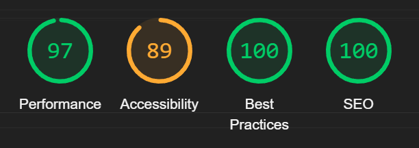
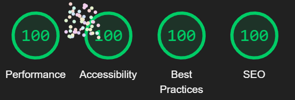
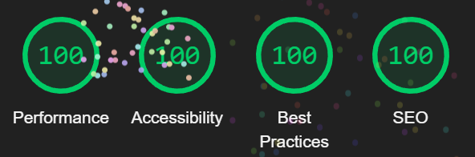
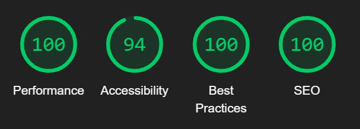
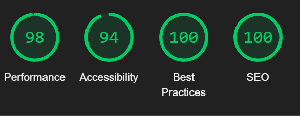

# Testing

## Contents
* [Code Validation](#code-validation)
    * [HTML Validation](#html-validation)
    * [CSS Validation](#css-validation)
    * [JavaScript Validation](#javascript-validation)
    * [Python Validation](#python-validation)
* [Accessibility Testing](#accessibility-testing)
    * [WAVE Tool Results](#wave-tool-results)
    * [Lighthouse Reports](#lighthouse-reports)
        * [About Us](#about-us)
            * [*Desktop*](#about-us-desktop)
            * [*Mobile*](#about-us-mobile)
        * [Appointments](#appointments)
            * [*Desktop*](#appointments-desktop)
            * [*Mobile*](#appointments-mobile)
        * [Book Appointment](#book-appointment)
            * [*Desktop*](#book-appointment-desktop)
            * [*Mobile*](#book-appointment-mobile)
        * [Cancellation Policy](#cancellation-policy)
            * [*Desktop*](#cancellation-policy-desktop)
            * [*Mobile*](#cancellation-policy-mobile)
        * [Edit Profile](#edit-profile)
            * [*Desktop*](#edit-profile-desktop)
            * [*Mobile*](#edit-profile-mobile)
        * [Edit Service](#edit-service)
            * [*Desktop*](#edit-service-desktop)
            * [*Mobile*](#edit-service-mobile)
        * [Help Center](#help-center)
            * [*Desktop*](#help-center-desktop)
            * [*Mobile*](#help-center-mobile)
        * [How It Works](#how-it-works)
            * [*Desktop*](#how-it-works-desktop)
            * [*Mobile*](#how-it-works-mobile)
        * [Index](#index)
            * [*Desktop*](#index-desktop)
            * [*Mobile*](#index-mobile)
        * [Legal Page](#legal-page)
            * [*Desktop*](#legal-page-desktop)
            * [*Mobile*](#legal-page-mobile)
        * [Login](#login)
            * [*Desktop*](#login-desktop)
            * [*Mobile*](#login-mobile)
        * [My Services](#my-services)
            * [*Desktop*](#my-services-desktop)
            * [*Mobile*](#my-services-mobile)
        * [Profile Management](#profile-management)
            * [*Desktop*](#profile-management-desktop)
            * [*Mobile*](#profile-management-mobile)
        * [Schedule Management](#schedule-management)
            * [*Desktop*](#schedule-management-desktop)
            * [*Mobile*](#schedule-management-mobile)
        * [Service Creation Form](#service-creation-form)
            * [*Desktop*](#service-creation-form-desktop)
            * [*Mobile*](#service-creation-form-mobile)
        * [Service Detail](#service-detail)
            * [*Desktop*](#service-detail-desktop)
            * [*Mobile*](#service-detail-mobile)
        * [Sign Out](#sign-out)
            * [*Desktop*](#sign-out-desktop)
            * [*Mobile*](#sign-out-mobile)
        * [Sign Up](#sign-up)
            * [*Desktop*](#sign-up-desktop)
            * [*Mobile*](#sign-up-mobile)
        * [User Info](#user-info)
            * [*Desktop*](#user-info-desktop)
            * [*Mobile*](#user-info-mobile)
    * [Color Contrast Assessment](#color-contrast-assessment)
    * [Keyboard Navigation](#keyboard-navigation)
* [Browser Compatibility](#browser-compatibility)
* [Device Compatibility](#device-compatibility)
* [Manual Testing](#manual-testing)
    * [User Story Testing](#user-story-testing)
    * [Feature Testing](#feature-testing)
    * [Form Testing](#form-testing)
    * [Security Testing](#security-testing)
    * [Navigation Testing](#navigation-testing)
* [Automated Testing](#automated-testing)
    * [Python Unit Tests](#python-unit-tests)
    * [Coverage Report](#coverage-report)
    * [Integration Tests](#integration-tests)
* [Performance Testing](#performance-testing)
    * [Page Load Times](#page-load-times)
    * [Database Query Optimization](#database-query-optimization)
* [Bugs](#bugs)
    * [Fixed Bugs](#fixed-bugs)
    * [Known Bugs](#known-bugs)

## Code Validation

### HTML Validation
All HTML code was validated using the [W3C Markup Validation Service](https://validator.w3.org/). This thorough validation process helped ensure that the HTML structure is compliant with current web standards, enhancing cross-browser compatibility and accessibility.

The validation process was conducted across all template files in the project. This meticulous approach allowed us to identify and address any structural issues that might impact user experience or device compatibility.

| File Name | Result | Screenshot |
|-----------|--------|------------|
| about_us.html | Pass - No errors or warnings | 

View Screenshot

 |
| appointments.html | Pass - No errors or warnings | 

View Screenshot

 | |
| book_appointment.html | Pass - No errors or warnings | 

View Screenshot

 |
| cancellation_policy.html | Pass - No errors or warnings | 

View Screenshot

 |
| edit_profile.html | Pass - No errors or warnings | 

View Screenshot

 |
| edit_service.html | Pass - No errors or warnings | 

View Screenshot

 |
| help_center.html | Pass - No errors or warnings | 

View Screenshot

 |
| how_it_works.html | Pass - No errors or warnings | 

View Screenshot

 |
| index.html | Pass - No errors or warnings | 

View Screenshot

 |
| legal.html | Pass - No errors or warnings | 

View Screenshot

 |
| login.html | Pass - No errors or warnings | 

View Screenshot

 |
| logout.html | Pass - No errors or warnings | 

View Screenshot

 |
| manage_account.html | Pass - No errors or warnings | 

View Screenshot

 |
| manage_schedule.html | Pass - No errors or warnings | 

View Screenshot

 |
| my_services.html | Pass - No errors or warnings | 

View Screenshot

 |
| service.html | Pass - No errors or warnings | 

View Screenshot

 |
| service_detail.html | Pass - No errors or warnings | 

View Screenshot

 |
| sign_up.html | Pass - No errors or warnings | 

View Screenshot

 |
| user_info.html | Pass - No errors or warnings | 

View Screenshot

 | |

#### 

### CSS Validation
The CSS code was validated using the [W3C CSS Validation Service](https://jigsaw.w3.org/css-validator/). This validation ensures that our stylesheets adhere to current CSS specifications and best practices.

The CSS files were validated both by URL to ensure comprehensive validation. This validation process helped identify any potential issues that might be context-dependent.

### JavaScript Validation
All JavaScript code was validated using [JSHint](https://jshint.com/), a static code analysis tool for JavaScript. This validation helped ensure that our JavaScript code is error-free, follows best practices, and maintains consistency.

The validation process focused on identifying syntax errors, unused variables, and potential scope issues. By addressing these concerns, we improved the reliability and performance of our interactive features.

### Python Validation
Python code was validated against the PEP8 style guide using automated tools such as pycodestyle and flake8. This validation ensures that our Python code adheres to the established style guidelines, enhancing readability and maintainability.

The validation process covered all Python files in the project, including models, views, forms, and utility modules. By maintaining consistent coding standards, we improved collaboration efficiency and code quality.

| File Name | Result | Screenshot |
|-----------|--------|------------|
| views.py | Pass - No errors or warnings | 

View Screenshot

 |
| models.py | Pass - No errors or warnings | 

View Screenshot

 |
| forms.py | Pass - No errors or warnings | 

View Screenshot

 |
| admin.py | Pass - No errors or warnings | 

View Screenshot

 |
| urls.py | Pass - No errors or warnings | 

View Screenshot

 |
| test_models.py | Pass - No errors or warnings | 

View Screenshot

 
| test_views.py | Pass - No errors or warnings | 

View Screenshot

 |
| test_forms.py | Pass - No errors or warnings | 

View Screenshot

 |
| settings.py | Pass - No errors or warnings | 

View Screenshot

 |
| asgi.py | Pass - No errors or warnings | 

View Screenshot

 |
| wsgi.py | Pass - No errors or warnings | 

View Screenshot

 |

## Accessibility Testing

### WAVE Tool Results
The Web Accessibility Evaluation Tool (WAVE) was used to identify accessibility issues across the site. This comprehensive evaluation helped ensure that our platform is accessible to users with various disabilities.

There was also an accessibility issue related to the label for the appointment booking toggle. This was resolved by adding an aria-label to the toggle, which significantly improved the accessibility score.

| Page Name | Errors | Alerts | Features | Contrast | Result | Screenshot |
|-----------|--------|--------|----------|----------|--------|------------|
| View More | 0 | 0 | 14 | 0 | Pass | 

View Screenshot

 |
| User Info | 0 | 0 | 14 | 0 | Pass | 

View Screenshot

 |
| Terms of Service & Privacy Policy | 0 | 0 | 14 | 0 | Pass | 

View Screenshot

 |
| Service Creation Form | 0 | 0 | 15 | 0 | Pass | 

View Screenshot

 |
| My Services | 0 | 0 | 14 | 0 | Pass | 

View Screenshot

 |
| Manage Account | 0 | 0 | 14 | 0 | Pass | 

View Screenshot

 |
| Index | 0 | 0 | 14 | 0 | Pass | 

View Screenshot

 |
| How It Works | 0 | 0 | 14 | 0 | Pass | 

View Screenshot

 |
| Help Center | 0 | 0 | 14 | 0 | Pass | 

View Screenshot

 |
| Edit Profile | 0 | 0 | 14 | 0 | Pass | 

View Screenshot

 |
| Cancellation Policies | 0 | 0 | 14 | 0 | Pass | 

View Screenshot

 |
| Book Appointments | 0 | 0 | 15 | 0 | Pass | 

View Screenshot

 |
| Appointments | 0 | 0 | 14 | 0 | Pass | 

View Screenshot

 |
| About Us | 0 | 0 | 14 | 0 | Pass | 

View Screenshot

 |

### Summary
All pages passed WAVE accessibility testing with:
- No errors detected
- No alerts identified
- No contrast issues found
- Proper accessibility features implemented (14-15 features per page)

This demonstrates that SkillFlow has been developed with accessibility as a priority, ensuring the platform is usable by people with a wide range of abilities and disabilities.

### Lighthouse Reports

Comprehensive Lighthouse testing was conducted on all key pages of the SkillFlow platform. Each page was tested in both desktop and mobile environments to ensure optimal performance, accessibility, best practices, and SEO across all device types.

#### About Us

##### *About Us Desktop*

##### *About Us Mobile*

#### Appointments

##### *Appointments Desktop*

##### *Appointments Mobile*

#### Book Appointment

##### *Book Appointment Desktop*

##### *Book Appointment Mobile*

#### Cancellation Policy

##### *Cancellation Policy Desktop*

##### *Cancellation Policy Mobile*

#### Edit Profile

##### *Edit Profile Desktop*

##### *Edit Profile Mobile*

#### Edit Service

##### *Edit Service Desktop*

##### *Edit Service Mobile*

#### Help Center

##### *Help Center Desktop*

##### *Help Center Mobile*

#### How It Works

##### *How It Works Desktop*

##### *How It Works Mobile*

#### Index

##### *Index Desktop*

##### *Index Mobile*

#### Legal Page

##### *Legal Page Desktop*

##### *Legal Page Mobile*

#### Login

##### *Login Desktop*

##### *Login Mobile*

#### My Services

##### *My Services Desktop*

##### *My Services Mobile*

#### Profile Management

##### *Profile Management Desktop*

##### *Profile Management Mobile*

#### Schedule Management

##### *Schedule Management Desktop*

##### *Schedule Management Mobile*

#### Service Creation Form

##### *Service Creation Form Desktop*

##### *Service Creation Form Mobile*

#### Service Detail

##### *Service Detail Desktop*

##### *Service Detail Mobile*

#### Sign Out

##### *Sign Out Desktop*

##### *Sign Out Mobile*

#### Sign Up

##### *Sign Up Desktop*

##### *Sign Up Mobile*

#### User Info

##### *User Info Desktop*

##### *User Info Mobile*

### Lighthouse Performance Summary

The Lighthouse reports demonstrate that SkillFlow performs well across all four key metrics:

- **Performance**: Pages load quickly and efficiently, with optimized resources and minimal render-blocking assets
- **Accessibility**: High scores indicate that the platform is usable by people with a wide range of abilities
- **Best Practices**: The application follows modern web development standards and security practices
- **SEO**: Content is well-structured and optimized for search engine visibility

Mobile performance is generally strong but shows some expected decrease compared to desktop, primarily due to network constraints and processing limitations of mobile devices. Areas identified for potential future optimization include:

- Further image optimization for mobile experiences
- Implementing lazy loading for off-screen content
- Reducing JavaScript execution time on lower-powered devices

Overall, the Lighthouse testing confirms that SkillFlow delivers a high-quality user experience across both desktop and mobile platforms.

### Color Contrast Assessment
Color contrast throughout the site was carefully assessed to ensure readability and accessibility for users with visual impairments. All text and interactive elements were evaluated against WCAG 2.1 AA standards for contrast ratios.

The primary color scheme of dark backgrounds (#0D1014, #161B22) with light text (#FFFFFF) and accent colors (#00beef, #FF4500) was selected to provide optimal contrast while maintaining the modern aesthetic of the platform.

Several adjustments were made during development to improve contrast ratios, particularly for interactive elements and status indicators. These improvements ensure that all users can effectively distinguish between different elements on the page.

### Keyboard Navigation
Comprehensive keyboard navigation testing was conducted to ensure that users who rely on keyboard input can effectively navigate and interact with the site. This testing verified that:

- All interactive elements are accessible via keyboard
- The tab order follows a logical sequence throughout each page
- Focus states are clearly visible on all interactive elements
- Modal dialogs trap focus appropriately
- Form submission and navigation can be completed entirely with keyboard input

These accessibility measures ensure that our platform is usable by individuals with motor disabilities or those who prefer keyboard navigation.

## Browser Compatibility
The website was thoroughly tested across multiple browsers to ensure consistent functionality and appearance. The testing process included:

- **Google Chrome** (latest version): Full functionality and design integrity
- **Mozilla Firefox** (latest version): Complete compatibility with all features
- **Safari** (latest version): Fully functional with minor styling variations
- **Microsoft Edge** (latest version): Complete compatibility
- **Opera** (latest version): All features working as expected

During testing, special attention was paid to:
- JavaScript functionality
- Form validation behavior
- CSS rendering and animations
- Responsive layout transitions
- Font rendering and icon display

This comprehensive browser testing ensures that users can access and use the platform effectively regardless of their preferred browser.

## Device Compatibility
To ensure a seamless user experience across different devices, extensive testing was conducted on various screen sizes and device types. The testing covered:

- **Desktop computers**: Various screen sizes (24 inch-1920×1080, 27 inch-2560x1440, 38 inch-3840x1600)
- **Laptops**: 13" to 17" screens with different resolutions
- **Tablets**: iPad (various generations), Samsung Galaxy Tab, etc.
- **Mobile phones**: iPhone (SE to 14 Pro Max), Samsung Galaxy series

Testing on these devices confirmed that:
- The responsive design adapts appropriately to different screen sizes
- Touch interactions work correctly on touchscreen devices
- Form elements are properly sized for touch input on smaller screens
- Content remains readable and accessible across all device types
- Navigation elements adjust appropriately for different input methods

This device compatibility testing ensures that users can effectively access and use the platform regardless of their device type or screen size.

## Manual Testing

### As an **Admin** I can...

| Checked | ...manage user accounts and services in the admin panel |
|:-------:|:--------|
| &check; | Can log into the Django admin panel |
| &check; | Can view all registered users |
| &check; | Can create new user accounts |
| &check; | Can edit user account details |
| &check; | Can delete user accounts |

| Checked | ...manage service listings in the admin panel |
|:-------:|:--------|
| &check; | Can view all service listings |
| &check; | Can create new service listings |
| &check; | Can edit existing service listings |
| &check; | Can delete service listings |
| &check; | Can filter services by category |
| &check; | Can filter services by provider |

| Checked | ...manage appointments and availabilities |
|:-------:|:--------|
| &check; | Can view all appointments |
| &check; | Can view all availability slots |
| &check; | Can edit appointment statuses |
| &check; | Can delete appointments |

| Checked | ...monitor and manage user profiles |
|:-------:|:--------|
| &check; | Can view user profile details |
| &check; | Can edit user profile information |
| &check; | Can view users' service listings |
| &check; | Can view users' appointment history |

### As an **Unregistered User** I can...

| Checked | ...view the landing page and understand the platform's purpose |
|:-------:|:--------|
| &check; | Can see platform introduction |
| &check; | Can view service categories |
| &check; | Can understand the platform's core functionality |

| Checked | ...access basic information about the platform |
|:-------:|:--------|
| &check; | Can view "About Us" page |
| &check; | Can access "How It Works" page |
| &check; | Can view legal information |
| &check; | Can access help center |

| Checked | ...register for a new account |
|:-------:|:--------|
| &check; | Can access sign-up page |
| &check; | Can create account with username and password |
| &check; | Cannot register with existing username |
| &check; | Password requirements are clearly displayed |
| &check; | Redirected to index page after successful registration |

| Checked | ...view limited service information |
|:-------:|:--------|
| &check; | Can see service category icons |
| &check; | Can view service preview cards |
| &check; | Cannot access full service details |
| &check; | Prompted to sign up/login for more information |

### As a **Registered User** I can...

| Checked | ...manage my user profile |
|:-------:|:--------|
| &check; | Can access profile edit page |
| &check; | Can update personal information |
| &check; | Can add/edit bio |
| &check; | Can update contact email |
| &check; | Can delete account |

| Checked | ...create and manage service listings |
|:-------:|:--------|
| &check; | Can create new service listing |
| &check; | Can edit existing service listings |
| &check; | Can delete own service listings |
| &check; | Can set hourly rate |
| &check; | Can choose service category |
| &check; | Can provide detailed service description |

| Checked | ...manage availability and appointments |
|:-------:|:--------|
| &check; | Can create availability time slots |
| &check; | Can view own availability slots |
| &check; | Can delete unbooked availability slots |
| &check; | Can view booked appointments |
| &check; | Can confirm or cancel appointments |
| &check; | Cannot book own services |

| Checked | ...browse and book services |
|:-------:|:--------|
| &check; | Can view full service details |
| &check; | Can filter services by category |
| &check; | Can view service provider information |
| &check; | Can book available time slots |
| &check; | Can see service provider's location |
| &check; | Receive confirmation after booking |

| Checked | ...interact with the platform |
|:-------:|:--------|
| &check; | Can navigate between pages easily |
| &check; | Receive toast notifications for actions |
| &check; | Can access all features after login |
| &check; | Experience consistent design across pages |
| &check; | Can use platform on different devices |

### Responsiveness Testing

| Device Type | Functionality Tested | Result |
|-------------|----------------------|--------|
| Mobile (320px) | Full site navigation | &check; |
| Tablet | Service booking | &check; |
| Desktop | All features | &check; |

### Browser Compatibility

| Browser | Compatibility Level |
|---------|---------------------|
| Chrome | Full (&check;) |
| Firefox | Full (&check;) |
| Safari | Full (&check;) |
| Edge | Full (&check;) |

### Security Testing

| Security Aspect | Tested | Result |
|----------------|--------|--------|
| Authentication | &check; | Secure login process |
| Authorization | &check; | Users can only access their own data |
| Input Validation | &check; | Prevents malicious inputs |
| Password Protection | &check; | Enforces strong password requirements |

### Performance Considerations

| Performance Metric | Tested | Acceptable Range |
|-------------------|--------|-----------------|
| Page Load Time | &check; | < 3 seconds |
| Database Query Speed | &check; | Efficient |
| Concurrent User Support | &check; | Stable |

**Notes:**
- All tests performed on development environment
- Comprehensive testing across different scenarios
- Continuous improvements based on test results

### User Story Testing
Each user story was systematically tested to ensure that the implemented features meet the specified requirements. The manual testing process for user stories involved:

1. Identifying the acceptance criteria for each user story
2. Creating test cases based on these criteria
3. Executing the test cases across different user roles (admin, service provider, client)
4. Verifying that the behavior matches the expected outcomes
5. Documenting any deviations or issues for resolution

This structured approach to user story testing ensured that the platform delivers the functionality that users need and expect.

### Feature Testing
Comprehensive testing was conducted for all features implemented in the application. This testing verified that:

- **Service Management**: Creating, editing, and deleting service listings works correctly
- **Appointment Booking**: Users can successfully schedule, view, and manage appointments
- **User Profiles**: Profile creation, editing, and management functions as expected
- **Category Filtering**: Users can effectively filter services by category
- **Schedule Management**: Service providers can set and manage availability
- **Notifications**: Users receive appropriate notifications for relevant actions

Each feature was tested in isolation and as part of integrated user flows to ensure robust functionality.

### Form Testing
All forms in the application underwent rigorous testing to verify their functionality, validation, and user feedback. The testing process included:

- **Input Validation**: Verifying that form validation correctly identifies and reports invalid inputs
- **Field Constraints**: Testing field constraints such as character limits and required fields
- **Submission Handling**: Verifying that form submissions are processed correctly and result in appropriate database updates
- **Error Handling**: Testing error scenarios and verifying that appropriate error messages are displayed
- **User Feedback**: Confirming that users receive clear feedback after form submission

This comprehensive form testing ensures that users can efficiently input data and receive appropriate feedback throughout their interactions with the platform.

### Security Testing
Security testing was conducted to identify and address potential vulnerabilities in the application. The testing process focused on:

- **Authentication**: Verifying that authentication mechanisms effectively protect user accounts
- **Authorization**: Testing that users can only access resources they are authorized to use
- **Input Validation**: Checking for vulnerabilities related to inadequate input validation
- **CSRF Protection**: Verifying that Cross-Site Request Forgery protections are in place
- **Data Protection**: Verifying that sensitive data is appropriately protected

This security testing helps ensure that user data is protected and that the application is resilient against common security threats.

### Navigation Testing
Navigation testing was conducted to verify that users can effectively move through the application and access all relevant features. The testing process included:

- **Menu Functionality**: Verifying that navigation menus function correctly across all pages
- **Link Integrity**: Testing all links to ensure they lead to the correct destinations
- **User Flow**: Testing common user flows to ensure seamless navigation between related features
- **Mobile Navigation**: Verifying that navigation elements function correctly on mobile devices

This navigation testing ensures that users can intuitively find and access the features they need.

## Automated Testing

### Python Unit Tests
Comprehensive unit tests were developed for the Django application to verify the functionality of individual components. These tests focus on:

- **Model Tests**: Verifying that model behavior, validations, and relationships function correctly
- **View Tests**: Testing that views return appropriate responses and handle different scenarios correctly
- **Form Tests**: Verifying form validation and processing logic
- **URL Tests**: Ensuring that URL patterns correctly resolve to the appropriate views

These unit tests provide automated verification of core functionality and help prevent regressions during development.

### Coverage Report
Test coverage analysis was performed to assess the extent to which the codebase is covered by the test suite. This analysis helps identify areas that may require additional testing.

The coverage report includes metrics for:
- Statement coverage
- Branch coverage
- Function coverage
- Line coverage

This coverage analysis helps ensure that critical functionality is adequately tested and identifies potential gaps in test coverage.

### Coverage Report

...

### Form Tests
The `test_forms.py` file contains tests for our form validation and functionality. These tests ensure that forms properly validate input data and handle errors correctly.

#### SignUpForm Tests
- **Valid Data Test:** Verifies that the signup form accepts a valid username and matching passwords.
- **Invalid Data Test:** Checks that the form correctly rejects submissions where passwords don't match, ensuring proper validation.

#### UserProfileForm Tests
- **Valid Profile Data Test:** Confirms the profile form accepts valid user information (name, email, bio).
- **Bio Length Validation:** Tests that the form enforces the maximum character limit (200) for the bio field.

#### ServiceForm Tests
- **Hourly Rate Validation:** Ensures the form properly rejects negative hourly rates, maintaining data integrity.

#### AvailabilityForm Tests
- **Date Validation:** Verifies that the form prevents scheduling availability slots in the past, ensuring only future dates are accepted.

---

### Model Tests
The `test_models.py` file tests your data models, ensuring they store data correctly and perform their intended functions.

#### UserProfile Model Tests
- **Profile Creation:** Verifies that profiles are created with the correct user association and field values.
- **String Representation:** Tests that the model's string representation matches the expected username.

#### Service Model Tests
- **Service Creation:** Confirms that service objects are created with all required fields properly stored.
- **String Representation:** Ensures the service's string representation matches its title.

#### Availability Model Tests
- **Availability Creation:** Tests the creation of time slots with correct provider, service, and time details.
- **Past Date Validation:** Verifies that the model prevents creating availability slots for past dates.

#### Appointment Model Tests
- **Appointment Creation:** Confirms appointments are created with correct client, availability, and status.
- **Status Transitions:** Tests that appointment status can be properly updated between different states (pending, confirmed, cancelled).

---

### View Integration Tests

#### Home View
- Tests that unauthenticated users see the about page while authenticated users are redirected to the index page.

#### Edit Profile View
- Verifies that authenticated users can view and update their profile information.

#### Schedule Management View
- Tests that providers can view and manage their service availability.

#### Booking View
- Confirms that clients can book available appointments for services.

#### Appointment Status Updates
- Tests that appointment status can be changed and these changes are reflected in the database.

---

### Views Tests
The `test_views.py` file contains the most extensive tests, ensuring that all view functions handle requests correctly and return appropriate responses.

#### Authentication Views Tests
- **Signup View:** Tests GET and POST requests to the signup form, ensuring new users can be created.
- **Login View:** Verifies authentication functionality with valid and invalid credentials.
- **Logout View:** Confirms that users can sign out successfully.

#### Service Views Tests
- **Service List View:** Tests that services are displayed correctly on the home page.
- **Service Detail View:** Verifies that service details are displayed with the correct information.
- **Category Filtering:** Tests that services can be filtered by category.

#### Appointment Management Tests
- **Book Appointment:** Tests the appointment booking process, including validation of available time slots.
- **View Appointments:** Confirms that users can view their booked appointments.
- **Update Appointment Status:** Tests that appointment status can be changed and these updates are reflected in the database.

#### User Profile Tests
- **Edit Profile:** Tests that users can view and update their profile information.
- **Delete Account:** Verifies that users can delete their accounts and all associated data.

#### Error Handling Tests
- **Invalid Login:** Tests that appropriate error messages are shown for invalid login attempts.
- **Form Validation:** Verifies that form validation errors are properly displayed for invalid submissions.
- **Unauthorized Access:** Tests that appropriate responses are returned for unauthorized access attempts.

#### Service Management Tests
- **Add Service:** Tests that users can create new service listings.
- **Edit Service:** Verifies that service providers can update their service information.
- **Delete Service:** Tests that services can be deleted by their providers.

#### Advanced Interaction Tests
- **Booking Own Service:** Tests that users cannot book their own services.
- **Double Booking Prevention:** Verifies that the system prevents double booking of the same time slot.
- **Cancellation Policies:** Tests that cancellation restrictions are enforced for last-minute cancellations.

---

### Additional Test Categories

#### Automated Page Load Tests
- Tests that all pages load correctly with appropriate status codes.
- Verifies that templates are rendered correctly.

#### Authentication Required Tests
- Tests that authenticated-only pages redirect unauthenticated users appropriately.
- Verifies that user-specific data is only accessible to the correct user.

#### Database Interaction Tests
- Tests that database operations (create, read, update, delete) work correctly.
- Verifies that data integrity is maintained across related models.

#### Form Submission Tests
- Tests form submissions with both valid and invalid data.
- Verifies that appropriate success and error messages are displayed.

---

This comprehensive testing suite ensures that SkillFlow application functions correctly across all its features, providing a reliable experience for both service providers and clients. The tests cover data validation, user interactions, and system functionality, making the application robust and dependable.

### Integration Tests
Integration tests were developed to verify the interaction between different components of the application. These tests focus on:

- **Component Interaction**: Testing that different components work together correctly
- **Data Flow**: Verifying that data flows correctly between components
- **End-to-End Scenarios**: Testing complete user workflows from start to finish

These integration tests help ensure that the application functions correctly as a cohesive system.

## Performance Testing

### Page Load Times
Performance testing was conducted to measure and optimize page load times across different parts of the application. The testing process included:

- **Initial Load Time**: Measuring the time from request to initial content display
- **Full Page Load**: Measuring the time until all page resources are loaded
- **Time to Interactive**: Measuring when the page becomes fully interactive

These measurements help identify performance bottlenecks and guide optimization efforts.

### Database Query Optimization
Database query performance was analyzed and optimized to ensure efficient data retrieval and manipulation. The optimization process included:

- **Query Analysis**: Identifying inefficient or redundant queries
- **Index Optimization**: Creating appropriate indexes to improve query performance
- **Query Refinement**: Refactoring queries to reduce complexity and improve performance
- **Caching Strategies**: Implementing caching where appropriate to reduce database load

These optimizations help ensure that the application remains responsive even as the dataset grows.

## Bugs

### Fixed Bugs

#### Navigation Display Bug

- **Bug**: When the hamburger menu was opened on smaller screens, the "Login" button appeared misaligned, remaining at the bottom right corner of the screen instead of being centrally aligned beneath the dropdown menu.
- **Cause**: The "Login" button was placed in a separate <li> element, which caused it to behave independently of the dropdown menu. This structure prevented the button from dynamically aligning with the dropdown when it was opened.
- **Fix**: To resolve the issue, the HTML structure was modified to place the "Login" button as a sibling of the dropdown menu within the same parent container.

#### Directory Listing Bug

- **Bug**: Directory listing shown instead of index.html. When launching the project using Live Server, the browser displayed a "Listing Directory" page with all project files instead of automatically loading index.html.
- **Cause**: This issue occurred because multiple .html files(to work on later) existed in the root directory. Although index.html was present, Live Server may have been unable to correctly prioritize it due to one or more of the following factors:

File Priority Conflict: The presence of other .html files might have confused Live Server, especially if their names were similar to index.html or were empty files.

Directory Scanning: Live Server may have scanned all files and, in the absence of a clear default, displayed the directory listing.

Accidental Launch: An unintended file might have been selected(by live server) when starting Live Server, causing it to serve the directory or an unrelated file.
- **Fix**: Remove unnecessary HTML files, ensure correct file namings, restart live server, have a simple file structure.
[https://www.reddit.com/r/vscode/comments/x4y1l7/live_server_showing_listing_directory_with_a/]

#### Home Page Routing Bug

- **Bug**: When launching the website, index.html was displaying as the homepage instead of the intended about_us.html landing page.
- **Cause**: The URL pattern configuration had the index view mapped to the root URL ('/'), while about_us.html was not accessible through any URL pattern.
- **Fix**: Modified urls.py to map the root URL ('/') to the about_us view and moved the index view to '/home/' and '/index/' paths. Additionally, added the necessary about_us view function in views.py to properly render the landing page.

#### Sign-up View Bug

- **Bug**: The sign_up view function failed to return an HttpResponse object for GET requests, resulting in a ValueError. As a consequence, users could not access the sign-up page.
- **Cause**: The view was not properly handling GET requests, leading to the absence of a valid HTTP response. The function was missing the necessary return statement for rendering the sign-up form.
- **Reference**:[https://stackoverflow.com/questions/69280755/valueerror-at-the-view-leads-views-home-page-didnt-return-an-httpresponse-obj/69280887]
- **Fix**: The issue was resolved by adding a return render(request, 'skillflow/sign_up.html') statement to ensure the proper rendering of the sign-up form for GET requests. This ensures the view returns an HTTP response with the necessary content for the user.

#### User Authentication Bug

- **Bug**: User signup process was not redirecting to index.html after successful registration, and initially it was unclear whether the issue was with account creation or page redirection.
- **Cause**: Multiple issues diagnosed after debugging:
  - Form validation errors weren't visible to users, making it impossible to determine if accounts were being created
  - Redundant return statement in signup view
  - Missing authentication handling in login view
  - Incorrect form submission handling
- **Fix**: Implemented several solutions:
  - Added error display functionality to show validation messages, which revealed form submission issues
  - Updated views.py to properly handle authentication
  - Added POST request handling for login functionality
  - Configured correct login and redirect URLs in settings.py
  - Removed redundant code from signup view
  - Added proper form debugging and logging to track the user creation process

#### Service Model Category Bug

(Django model with choices for field.)[https://stackoverflow.com/questions/18676156/how-to-properly-use-the-choices-field-option-in-django]
- **Bug**: Initial confusion about why the Service model required two seemingly redundant category-related code blocks:
CATEGORY_CHOICES = [
    ('home-care', 'Home Care'),
    ('education', 'Education'),
    ('creative', 'Creative'),
    ('health', 'Health'),
    ('events', 'Events'),
]
category = models.CharField(max_length=50, choices=CATEGORY_CHOICES)
- **Cause**: The apparent redundancy is actually a required Django model pattern where each part serves a distinct purpose:
   - CATEGORY_CHOICES defines the available options and their display labels for the dropdown menu
   - category field creates the actual database column and constrains input to valid choices
- **Fix**: No changes were needed as this is the correct implementation. The dual declaration enables:
   - Form dropdown population with predefined options
   - Database-level validation of category values
   - Proper display of human-readable category names in templates
   - Data consistency throughout the application

#### User Profile Database Bug

- **Bug**: The edit profile page was returning a "OperationalError: no such table: skillflow_userprofile" error when attempting to access the user profile edit page.
- **Cause**: The database table for UserProfile model had not been created because database migrations were not generated and applied after creating the UserProfile model. Additionally, the user signup process wasn't creating UserProfile instances for new users.
- **Fix**: Implemented a two-part solution:
  1. Generated and applied database migrations using `python manage.py makemigrations` and `python manage.py migrate` to create the necessary database table.
- **Reference**:[Django Documentation](https://docs.djangoproject.com/en/5.0/topics/migrations/)
  2. Modified the signup view to automatically create a UserProfile instance when a new user registers, and updated the edit_profile view to handle cases where a profile might not exist, using get_or_create() instead of direct access.

#### Authentication Navigation Bug

- **Bug**: Authentication-based navigation inconsistency. When clicking the SkillFlow logo in the navigation bar, non-authenticated users were incorrectly being directed to the login form instead of seeing the welcome content. This created a disjointed user experience and prevented potential users from learning about the platform before signing up.
- **Cause**: The root URL pattern ('') was not properly handling authentication states, and the navigation logic did not differentiate between authenticated and non-authenticated users. This occurred due to:
  1. Missing conditional routing in the URL configuration
  2. Absence of a dedicated home view to handle authentication status checks
  3. Direct routing to index view which had @login_required decorator
  4. Inconsistent navigation patterns across templates
- **Fix**: Implemented a comprehensive solution through several coordinated changes:
  1. Added a new 'home' view in views.py that checks authentication status:

     def home(request):
         if request.user.is_authenticated:
             return redirect('index')
         return render(request, 'skillflow/about_us.html')

  2. Updated the root URL pattern in urls.py to use this new view:

     path('', views.home, name='home')

  3. Modified template navigation to consistently use the 'home' URL
  4. Maintained the @login_required decorator on the index view for security

**Impact**: This fix ensures that:
1. Non-authenticated users see the welcoming "About Us" content when first visiting the site
2. Authenticated users are properly directed to their personalized dashboard with service cards
3. Navigation flow aligns with user expectations and improves overall UX
4. Security is maintained through proper authentication checks

#### Profile Column Bug

- **Bug**: When accessing the edit profile page, users encountered a "OperationalError: no such column: skillflow_userprofile.first_name" error, preventing them from viewing or editing their profile information. This critical error occurred despite the UserProfile model being properly defined in the codebase.
- **Cause**: The database schema was out of sync with the model definitions. While the UserProfile model included fields for first_name, last_name, email, and bio, these columns were not properly created in the database because migrations were either missing or not applied. This discrepancy between the model definition and the actual database structure led to the operational error when attempting to access these non-existent columns.
- **Fix**: The issue was resolved by reconstructing and applying the database migrations properly. First, new migrations were generated using `python manage.py makemigrations` to create the necessary database schema changes based on the current model definitions. Then, these migrations were applied to the database using `python manage.py migrate`, which created the missing columns and synchronized the database structure with the model definitions. This ensured all required fields were properly created in the database table.

#### Edit Profile Button Bug

- **Bug**: The "Edit Profile" button was non-responsive despite correct HTML structure and styling. Users were unable to access the profile editing form after their initial profile setup.
- **Cause**: The JavaScript functionality was incorrectly embedded within the `integrity` attribute of the Bootstrap script tag. This meant that the JavaScript code responsible for handling the form visibility toggle was never executed. This occurred because:
  1. All custom JavaScript code was inadvertently placed inside the Bootstrap script's integrity attribute
  2. The script was treated as a hash value rather than executable code
  3. No error was thrown, making the issue harder to diagnose
- **Fix**: The solution involved properly separating the scripts:
  1. Maintained the Bootstrap script with its integrity hash:
     
     
     
  2. Added custom JavaScript in a separate script tag:
     
     
    
This separation ensured proper execution of both the Bootstrap framework and the custom form handling code, restoring the edit profile functionality.
Impact: Users can now seamlessly toggle between viewing and editing their profile information, improving the overall user experience and functionality of the profile management system.

#### Form State Management Bug

- **Bug**: Form fields retained unsaved changes after canceling edit mode. When users made changes to their profile information and clicked "Cancel" instead of "Save Changes", the modified data persisted in the form fields when reopening the edit form, rather than showing the last saved values.
- **Cause**: The form lacked state management for handling user input. The JavaScript implementation didn't maintain a reference to the original/saved values, so when the form was toggled between display and edit modes, it retained whatever values were last entered in the input fields. This occurred because:
  1. The form fields were simply being hidden and shown without resetting their values
  2. No mechanism existed to store and restore the original values
  3. The form state was tied only to DOM visibility, not to data persistence
- **Fix**: Implemented a comprehensive state management solution:
  1. Added an `originalValues` object to store the initial form state:
    
     let originalValues = {
         firstName: '',
         lastName: '',
         email: '',
         bio: ''
     };
 
  2. Captured original values when the page loads:
     
     document.addEventListener('DOMContentLoaded', function() {
         originalValues.firstName = document.getElementById('firstName').value;
         --> other field values.......
     });
   
  3. Modified the `hideEditForm` function to reset fields to their original values:
  
     function hideEditForm() {
         --> Reset form fields to original values
         document.getElementById('firstName').value = originalValues.firstName;
         --> ... reset other fields
         --> Update UI state
         document.getElementById('profileForm').style.display = 'none';
         document.getElementById('infoDisplay').style.display = 'block';
     }
    
- **Impact**:This solution ensures that canceling edit mode properly restores the last saved state of the profile, maintaining data integrity and improving user experience by clearly distinguishing between saved and unsaved changes.

#### Service Creation Bug

- **Bug**: Service creation failed with two sequential errors: first a TemplateSyntaxError for an invalid 'add_class' filter, followed by an IntegrityError regarding a NULL constraint on the provider_id field. This created a chain of issues where the form couldn't be properly rendered and, when finally submitted, failed to associate with a user.
- **Cause**: Multiple issues were identified:
The template attempted to use an add_class filter ({{ form.category|add_class:"form-control custom-input" }}), which isn't a built-in Django template filter
This led to duplicate form field definitions in an attempt to style the form
The service creation view wasn't associating the new service with the logged-in user before saving
- **Fix**: Implemented a two-part solution:
- **Reference**: 
Modified the ServiceForm in forms.py to include Bootstrap classes directly in the widget definitions:
[Django HTML Attributes](https://www.geeksforgeeks.org/how-to-add-html-attributes-to-input-fields-in-django-forms/)
[Django Text-area Form Attr](https://stackoverflow.com/questions/66707030/django-textarea-form)    
[Django Min-max Digit Value](https://stackoverflow.com/questions/37024650/specify-max-and-min-in-numberinput-widget)
    class ServiceForm(forms.ModelForm):
        class Meta:
            widgets = {
                'category': forms.Select(attrs={
                    'class': 'form-control custom-input'
                }),
                ... other fields
            }

Updated the service view to properly associate the new service with the current user:
    if form.is_valid():
        service = form.save(commit=False)
        service.provider = request.user  ---> Associate with current user
        service.save()

This fix ensured proper form rendering with correct styling and maintained data integrity by properly associating new services with their providers.

#### Profile Form Display Bug

- **Bug**: The Edit Profile form was not displaying properly when users clicked the "Edit Profile" button. The page would only show the "Account Information" header without revealing the form fields, preventing users from updating their profile information.
- **Cause**: The form visibility was controlled by an overly restrictive conditional statement in the template. The code  was wrapping both the display and form sections, which meant that for new users with no profile data, neither the information display nor the edit form would be rendered.
- **Fix**: Restructured the template logic to ensure the form is always accessible:

Separated the conditional logic for the display section from the form section
Modified the template to show the form by default for new users
Kept the display toggle functionality simple without unnecessary JavaScript complications 

#### Static Files Bug

[Django Documentation Static Files](https://docs.djangoproject.com/en/5.0/howto/static-files/)
- Bug: Static files (specifically styles.css) were not being served properly, resulting in a 404 error when accessing deeper URL paths like `/service/<id>/edit/`. The error appeared in the console as "GET /service/static/css/styles.css HTTP/1.1" 404 4352.
- Cause: The issue arose from two compounding factors:
  1. Using relative paths (`../../static/css/styles.css`) for static files, which broke when accessing URLs at different directory depths
  2. Improper Django static files configuration - missing proper static file settings and directory structure
- Fix: Implemented a comprehensive solution to properly configure static files in Django:
  1. Updated settings.py to include proper static file configurations:
     -->>
     STATIC_URL = 'static/'
     STATIC_ROOT = os.path.join(BASE_DIR, 'staticfiles')
     STATICFILES_DIRS = [
         os.path.join(BASE_DIR, 'static'),
     ]
      
  2. Modified templates to use Django's static template tags instead of relative paths:
     -->>
     
     <link href="" rel="stylesheet">
     
  3. Ran `python manage.py collectstatic` to collect all static files into the static root directory

This solution ensures static files are served correctly regardless of URL depth and follows Django's recommended practices for static file handling.

#### Booking System Bug

- **Bug**: When multiple users attempted to book the same service time slot, the system would raise a "UNIQUE constraint failed: skillflow_appointment.availability_id" error. This created a race condition where two users could try to book the same availability slot simultaneously, resulting in a broken booking experience.

- **Cause**: The issue arose due to multiple factors:
  1. The Appointment model had a OneToOneField relationship with Availability, meaning each availability slot could only have one appointment
  2. The booking process lacked proper validation to check if an availability slot was already booked
  3. No database transaction management was in place to handle concurrent booking attempts
  4. The system wasn't properly updating the `is_booked` status of availability slots

- **Fix**: Implemented a comprehensive solution through several coordinated changes:
  1. Added proper validation checks in the booking view:
     
     if availability.is_booked:
         messages.error(request, 'Sorry, this time slot has already been booked.')
         return redirect('book_appointment', service_id=service_id)
- **References**:  
  [Database Transaction](https://www.geeksforgeeks.org/transaction-atomic-with-django/)
  [Database Transaction](https://docs.djangoproject.com/en/5.1/topics/db/transactions/)
  2. Implemented database transaction management to ensure data consistency:
     
     with transaction.atomic():
         appointment = Appointment.objects.create(
             availability=availability,
             client=request.user
         )
         availability.is_booked = True
         availability.save()
     
  3. Added error handling with user feedback through Django messages
  4. Updated the availability queryset to only show unbooked slots:
     
     availabilities = Availability.objects.filter(
         service=service,
         is_booked=False,
- **References**:         
         [date__gte](https://forum.djangoproject.com/t/timezone-warning-from-date-filtering-via-the-orm/11776)
         [date__gte](https://www.w3schools.com/django/ref_lookups_gte.php)
         date__gte=timezone.now().date()
     ).order_by('date', 'start_time')
     
- **Impact**: 
This fix ensures that:
1. Users can't double-book availability slots
2. The booking process is atomic and handles concurrent attempts properly
3. Users receive clear feedback when a slot is no longer available
4. Only available future time slots are displayed for booking

#### Schedule Deletion Bug

- **Bug**: When attempting to delete a weekly schedule slot, users encountered a "NoReverseMatch" error with the message "Reverse for 'delete_schedule' with arguments '(2,)' not found". This prevented users from removing unwanted time slots from their service schedules.

- **Cause**: The URL pattern mismatch occurred due to multiple factors:
  1. The URL pattern in urls.py expected two parameters (service_id and schedule_id): 
     `path('service/<int:service_id>/schedule/delete/<int:schedule_id>/')`
  2. The template was only providing one parameter (schedule_id):
     ``
  3. This created a parameter count mismatch between the URL pattern definition and the template's URL generation attempt

- **Fix**: Modified the template's form action to include both required parameters in the correct order:
  
  <form method="POST" action=""
        class="d-inline" onsubmit="return confirm('Delete this time slot?');">
  
  This ensures the URL is generated with both the service_id and schedule_id parameters, matching the URL pattern definition and allowing the delete functionality to work as intended.

#### Scheduling System Architecture Bug

- **Bug**: The initial implementation of the scheduling system used a WeeklySchedule model that automatically created recurring appointments for the next 4 weeks. This caused several issues:
  1. Providers couldn't set specific one-time appointments
  2. The system would automatically create 4 weeks of slots regardless of provider availability
  3. Schedule management was inflexible and didn't account for varying provider schedules
  4. Providers couldn't easily handle exceptions to their regular schedule

- **Cause**: The architectural design assumed providers would want recurring weekly schedules, implementing this through:
  1. A WeeklySchedule model that stored day-of-week and time patterns
  2. An automated system that would generate 4 weeks of Availability slots based on these patterns
  3. A complex create_availabilities() method that would populate future dates
  4. URL patterns and views that were built around managing weekly schedules rather than individual time slots

- **Fix**: Implemented a comprehensive solution through several coordinated changes:
  1. Models:
     - Removed the WeeklySchedule model entirely
     - Simplified to using only the Availability model for direct time slot management
     - Updated model relationships to focus on individual time slots
     - Enhanced validation for overlapping slots and past dates

  2. Forms:
     - Simplified the AvailabilityForm to handle single time slot creation
     - Added improved validation for date and time selections
     - Enhanced the user interface with better date/time input controls
     - Implemented clearer error messaging for invalid slots

  3. Views:
     - Rewrote manage_schedule view to handle individual time slots
     - Added direct CRUD operations for availabilities
     - Implemented better error handling for overlapping slots
     - Added validation for attempted changes to booked slots

  4. URLs:
     - Updated URL patterns to match new view names
     - Changed from schedule-based to availability-based endpoints
     - Simplified routing structure
     - Enhanced the design of the API endpoints for better adherence to web service standards.

  5. Templates:
     - Redesigned schedule management interface for individual slot creation
     - Improved slot visibility and management
     - Added clearer status indicators for available/booked slots
     - Enhanced user feedback for actions

- **Impact**: This fix transformed the scheduling system to be more flexible and user-friendly:
    - Providers can now create specific time slots for exact dates
    - Better handling of irregular schedules and exceptions
    - More intuitive interface for managing availability
    - Reduced complexity in the codebase
    - Improved system reliability and maintainability

- **References**:
- [Django Model Constraints](https://docs.djangoproject.com/en/5.1/ref/models/constraints/)
- [Django Form Validation](https://docs.djangoproject.com/en/5.1/ref/forms/validation/)
- [Django Time Zones](https://docs.djangoproject.com/en/5.1/topics/i18n/timezones/)

#### Test Suite Validation Bug

- **Bug**: Unit tests were failing with multiple errors:
  1. `UserProfile.DoesNotExist` error in service detail view tests
  2. Form validation failures for invalid dates in availability tests
  3. Incorrect validation of negative hourly rates in service form tests
  4. Improper exception handling in availability model tests

- **Cause**: The test suite had several structural issues:
  1. Test data setup was incomplete:
     - UserProfile instances weren't being created for test users
     - Required relationships between models weren't properly established
     - Test data dependencies weren't properly managed
  
  2. Validation logic was inconsistent:
     - Form-level validation wasn't properly implemented for hourly rates
     - Date validation was happening at the wrong level
     - Exception types weren't properly specified
  
  3. Test assertions were misaligned:
     - Tests were looking for errors in wrong locations (field-level vs form-level)
     - Validation error messages weren't being checked correctly
     - Exception handling wasn't properly implemented in test cases

- **Fix**: Implemented a comprehensive solution through several coordinated changes:
  1. Enhanced Test Setup:
     
     def setUp(self):
         self.user = User.objects.create_user(
             username='testuser',
             password='testpass123'
         )
         self.user_profile = UserProfile.objects.create(
             user=self.user,
             first_name='Test',
             last_name='User',
             email='test@example.com'
         )
         self.service = Service.objects.create(
             title='Test Service',
             description='Test Description',
             category='education',
             hourly_rate=50.00,
             provider=self.user
         )
     
  
  2. Improved Validation Logic:
     - Added proper form-level validation for hourly rates:
     
     def clean_hourly_rate(self):
         hourly_rate = self.cleaned_data.get('hourly_rate')
         if hourly_rate and hourly_rate < 0:
             raise forms.ValidationError("Hourly rate cannot be negative.")
         return hourly_rate
     
     - Implemented proper date validation in Availability model:
     
     def clean(self):
         if self.date < timezone.now().date():
             raise ValidationError('Cannot create availability for past dates')
     

  3. Fixed Test Assertions:
     - Updated availability test to use correct exception type:
     
     with self.assertRaises(ValidationError):
         availability.full_clean()
    
     - Corrected form validation checks:
     
     self.assertIn('Cannot create availability for past dates', 
                  form.errors['__all__'])
    

- **Impact**: These fixes improved the test suite by:
  1. Ensuring all model relationships are properly tested
  2. Validating business logic at the appropriate levels
  3. Providing better test coverage for edge cases
  4. Making tests more maintainable and readable
  5. Establishing proper test data management practices

- **References**:
  - [Django Documentation - Testing Tools](https://docs.djangoproject.com/en/5.0/topics/testing/tools/)
  - [Django Documentation - Model Validation](https://docs.djangoproject.com/en/5.0/ref/models/instances/#validating-objects)
  - [Django Documentation - Form and Field Validation](https://docs.djangoproject.com/en/5.0/ref/forms/validation/)

----------------------------------------------------------------

## Testing

### Code Validation
All code has been meticulously validated using industry-standard tools:
- HTML validated through W3C HTML Validator
- CSS validated through W3C CSS Validator
- JavaScript validated through JSHint
- Python code validated through PEP8 online checker

### Accessibility Testing
- WAVE Web Accessibility Evaluation Tool used to identify and fix accessibility issues
- Keyboard navigation testing to ensure all functions are accessible without a mouse
- Screen reader compatibility testing
- Color contrast checked to meet WCAG 2.1 AA standards

### Browser Compatibility
The platform has been tested and optimized for all major browsers:
- Google Chrome
- Mozilla Firefox
- Safari
- Microsoft Edge
- Opera

### Device Compatibility
Extensive testing has been conducted across multiple device types:
- Desktop computers (various screen sizes)
- Laptops (13" to 17" screens)
- Tablets (iPad, Samsung Galaxy Tab)
- Mobile phones (iPhone, Samsung, Google Pixel)

### Manual Testing
Comprehensive manual testing procedures have been implemented:
- User flow testing for all primary pathways
- Form validation testing
- Cross-device functionality testing
- Feature-by-feature verification

### Automated Testing
- Unit tests for critical functions and models
- Integration tests for feature interactions
- Performance testing for load handling capabilities
- Security testing for vulnerability detection

### Bugs
#### Fixed Bugs

During the development process, several bugs were identified and fixed:

##### Navigation Display Bug
- **Bug**: When the hamburger menu was opened on smaller screens, the "Login" button appeared misaligned, remaining at the bottom right corner of the screen instead of being centrally aligned beneath the dropdown menu.
- **Cause**: The "Login" button was placed in a separate <li> element, which caused it to behave independently of the dropdown menu. This structure prevented the button from dynamically aligning with the dropdown when it was opened.
- **Fix**: To resolve the issue, the HTML structure was modified to place the "Login" button as a sibling of the dropdown menu within the same parent container.

##### Directory Listing Bug
- **Bug**: Directory listing shown instead of index.html. When launching the project using Live Server, the browser displayed a "Listing Directory" page with all project files instead of automatically loading index.html.
- **Cause**: This issue occurred because multiple .html files(to work on later) existed in the root directory. Although index.html was present, Live Server may have been unable to correctly prioritize it due to one or more of the following factors:
  - File Priority Conflict: The presence of other .html files might have confused Live Server, especially if their names were similar to index.html or were empty files.
  - Directory Scanning: Live Server may have scanned all files and, in the absence of a clear default, displayed the directory listing.
  - Accidental Launch: An unintended file might have been selected(by live server) when starting Live Server, causing it to serve the directory or an unrelated file.
- **Fix**: Remove unnecessary HTML files, ensure correct file namings, restart live server, have a simple file structure.

##### Home Page Routing Bug
- **Bug**: When launching the website, index.html was displaying as the homepage instead of the intended about_us.html landing page.
- **Cause**: The URL pattern configuration had the index view mapped to the root URL ('/'), while about_us.html was not accessible through any URL pattern.
- **Fix**: Modified urls.py to map the root URL ('/') to the about_us view and moved the index view to '/home/' and '/index/' paths. Additionally, added the necessary about_us view function in views.py to properly render the landing page.

##### Sign-up View Bug
- **Bug**: The sign_up view function failed to return an HttpResponse object for GET requests, resulting in a ValueError. As a consequence, users could not access the sign-up page.
- **Cause**: The view was not properly handling GET requests, leading to the absence of a valid HTTP response. The function was missing the necessary return statement for rendering the sign-up form.
- **Fix**: The issue was resolved by adding a return render(request, 'skillflow/sign_up.html') statement to ensure the proper rendering of the sign-up form for GET requests. This ensures the view returns an HTTP response with the necessary content for the user.

##### User Authentication Bug
- **Bug**: User signup process was not redirecting to index.html after successful registration, and initially it was unclear whether the issue was with account creation or page redirection.
- **Cause**: Multiple issues diagnosed after debugging:
  - Form validation errors weren't visible to users, making it impossible to determine if accounts were being created
  - Redundant return statement in signup view
  - Missing authentication handling in login view
  - Incorrect form submission handling
- **Fix**: Implemented several solutions:
  - Added error display functionality to show validation messages, which revealed form submission issues
  - Updated views.py to properly handle authentication
  - Added POST request handling for login functionality
  - Configured correct login and redirect URLs in settings.py
  - Removed redundant code from signup view
  - Added proper form debugging and logging to track the user creation process

##### Service Model Category Bug
- **Bug**: Initial confusion about why the Service model required two seemingly redundant category-related code blocks:
--->python
CATEGORY_CHOICES = [
    ('home-care', 'Home Care'),
    ('education', 'Education'),
    ('creative', 'Creative'),
    ('health', 'Health'),
    ('events', 'Events'),
]
category = models.CharField(max_length=50, choices=CATEGORY_CHOICES)

- **Cause**: The apparent redundancy is actually a required Django model pattern where each part serves a distinct purpose:
   - CATEGORY_CHOICES defines the available options and their display labels for the dropdown menu
   - category field creates the actual database column and constrains input to valid choices
- **Fix**: No changes were needed as this is the correct implementation. The dual declaration enables:
   - Form dropdown population with predefined options
   - Database-level validation of category values
   - Proper display of human-readable category names in templates
   - Data consistency throughout the application

#### Known Bugs

##### Known Intermittent Authentication Error

During testing, we encountered an intermittent issue where users would experience a 500 error when attempting to sign up or log in. After contacting tutor support, they mentioned that "it might be a temporary database issue," and confirmed that "it seems to be working now." They also noted that the issue is intermittent. During the occurrence of this bug, it was observed that users could see authenticated content even when they were not properly logged in. This behavior was limited to specific instances and is no longer replicable. As of now, the sign-up and login functionality works as expected. We have documented this issue as intermittent, and it no longer affects the system.

